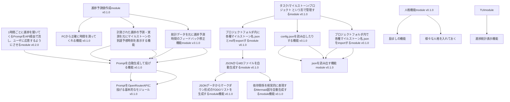

## 依存関係図

```mermaid
graph TD
    %% メインモジュール
    A["1時間ごとに進捗を聞いてくるPromptをAPI経由で流し、ユーザに応答するようにさせるmodule v0.2.0"]
    B["タスク/マイルストーン/プロジェクト という形で管理するmodule v0.1.0"]
    C["進捗予測値作成module v0.1.0"]
    D["人格機能module v0.1.0"]
    E["TUImodule"]

    %% サブモジュール
    A1["Promptを自動生成して投げる機能 v0.1.0"]
    B1["プロジェクトフォルダ内に各種マイルストーン名.jsonとmdをexportするmodule v0.1.0"]
    B2["config.jsonを読み出したりする機能 v0.1.0"]
    B3["プロジェクトフォルダ内で各種マイルストーン名.jsonをimportするmodule v0.1.0"]
    C1["PCから正確に時間を測ってくれる機能 v0.1.0"]
    C2["計測された進捗の予測・実測を元にマイルストーンの到達予想時刻を表示する機能"]
    C3["統計データを元に進捗予測時間のフィードバック修正機能module v.0.1.0"]
    D1["励ましの機能"]
    D2["様々な人格を入れておく"]
    E1["進捗統計表示機能"]
    F1["JSONからMDファイルを自動生成するmodule v0.1.0"]
    F2["JSONデータからマークダウン形式のTODOリストを生成するmodule機能 v0.1.0"]
    F3["依存関係を視覚的に表現するMermaid図を自動生成するmodule機能 v0.1.0"]

    %% 共通基盤モジュール
    Z["PromptをOpenRouterAPIに投げる基本的なモジュール v0.1.0"]
    J["jsonを読み出す機能 module v0.1.0"]

    %% 依存関係
    A --> A1
    A1 --> Z
    B --> B1
    B --> B2
    B --> B3
    B1 --> F1
    B2 --> J
    B3 --> J
    C --> C1
    C --> C2
    C --> C3
    C2 --> A1
    C3 --> A1
    D --> D1
    D --> D2
    E --> E1
    F1 --> F2
    F1 --> F3

    %% 重複依存の強調表示
    A1 --> Z
    C2 --> A1
    C3 --> A1
    B2 --> J
    B3 --> J
```